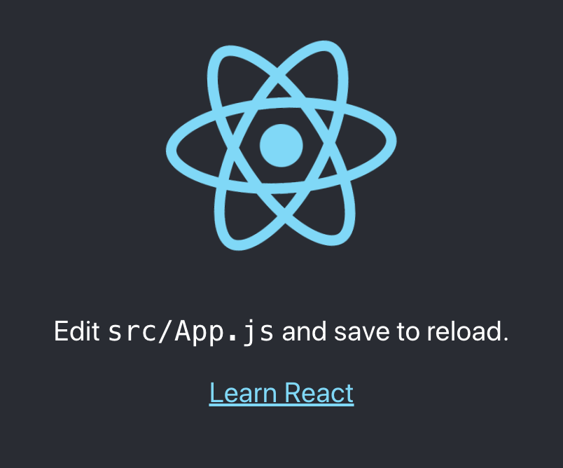
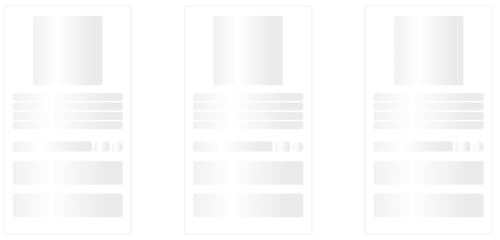
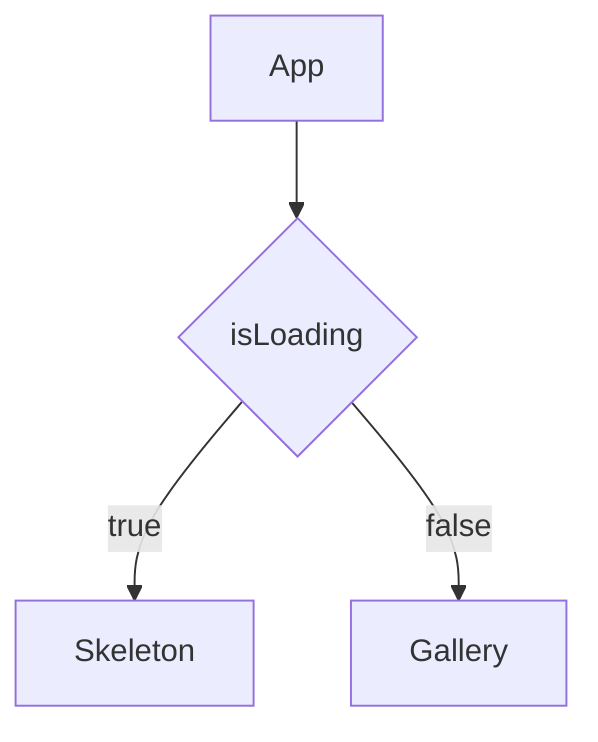

# React JS でスケルトンローディングを実装するサンプル

## 事前準備

まずは React アプリ を作成する

```bash
# create-react-appコマンドをインストール
npm install create-react-app --global
# Reactアプリを作成
npx create-react-app sample-react-loading-skeleton
# スケルトンローディングのモジュールをインストール
npm install react-loading-skeleton
# その他このサンプルで必要なライブラリをインストール
npm install axios styled-components react-icons
# Reactアプリの起動
npm start
```



## スケルトンコンポーネントを作成する

Array.fill() でコンポーネントを必要な分だけ生成する。

```jsx
const SkeletonGallery = () => {
  const rows = Array(9)
    .fill()
    .map((item, index) => (
      <section key={index}>
        <article className="item">
          <div className="item-img">
            <Skeleton width={140} height={140} />
          </div>
          <h3 className="item-title">
            <Skeleton count={4} />
          </h3>
          <div className="item-info">
            <Skeleton width={160} height={20} />
            <Skeleton width={30} height={20} />
            <Skeleton width={22} height={22} circle={true} />
          </div>
          <Skeleton height={48} count={2} className="skeleton" />
        </article>
      </section>
    ));

  return (
    <SkeletonTheme color="#F5F5F5" highlightColor="#ffffff">
      <GalleryStyles className="gallery__grid">
        <div className="gallery__grid">{rows}</div>
      </GalleryStyles>
    </SkeletonTheme>
  );
};
```



## スケルトンローディングと実データを出し分ける

isLoading を使ってデータがローディングであればスケルトンコンポーネントを表示するようにする。



```jsx
const Gallery = () => {
  const [products, setProducts] = useState([]);
  const [isLoading, setLoading] = useState(true);

  const fetchData = () => {
    axios
      .get('https://fakestoreapi.com/products/category/electronics/')
      .then(({ data }) => {
        setProducts(data);
        setLoading(false);
      });
  };
  // ローディングするためにあえて遅延させる
  useEffect(() => {
    setTimeout(() => {
      fetchData();
    }, 10000);
  }, []);

  return (
    <GalleryStyles>
      <div className="gallery__grid">
        {isLoading ? (
          <SkeletonGallery />
        ) : (
          products.map((product) => {
            return (
              <section key={product.id}>
                <article className="item">
                  <div className="item-img">
                    
                  </div>
                  <h3 className="item-title">{product.title}</h3>
                  <div className="item-info">
                    <span>{product.category}</span>
                    <div className="item-rating">
                      <span>{product.rating.rate}</span>
                      <span className="item-start">
                        <FaStar fill="yellow" />
                      </span>
                    </div>
                  </div>
                  <h3 className="item-price">${product.price}</h3>
                  <div className="item__btns">
                    <button className="item__btnadd">Add to card</button>
                    <button className="item__btnbuy">Buy now</button>
                  </div>
                </article>
              </section>
            );
          })
        )}
      </div>
    </GalleryStyles>
  );
};
```


## さいごに

完全なソースコードは [こちら](https://github.com/takiguchi-yu/sample-react-loading-skeleton) を参照ください。

# 参考資料

https://github.com/dvtng/react-loading-skeleton

https://www.smashingmagazine.com/2020/04/skeleton-screens-react/

https://blog.bitsrc.io/how-to-build-a-skeleton-loader-with-react-1dd359cda582
